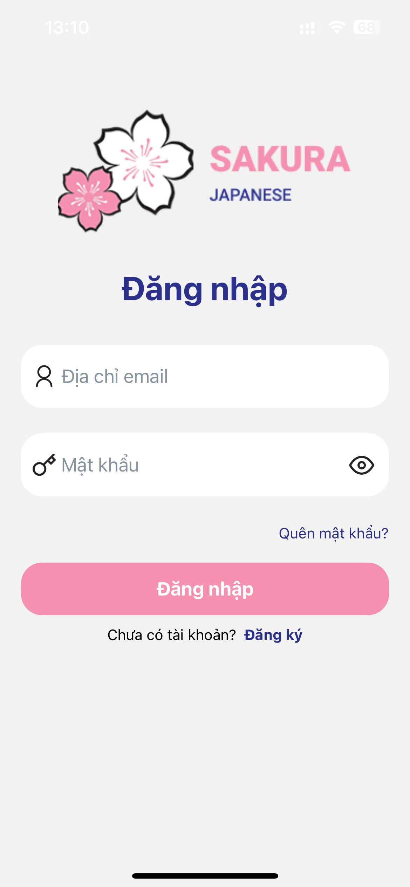
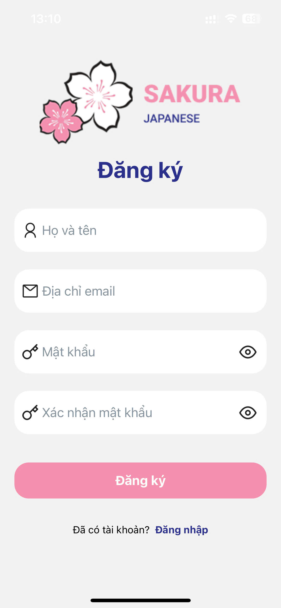
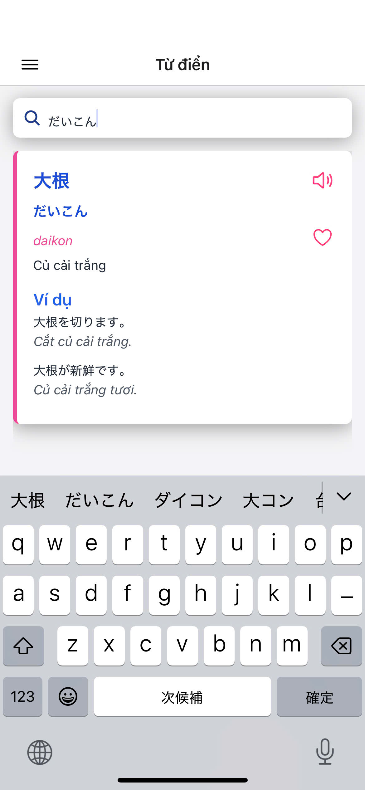
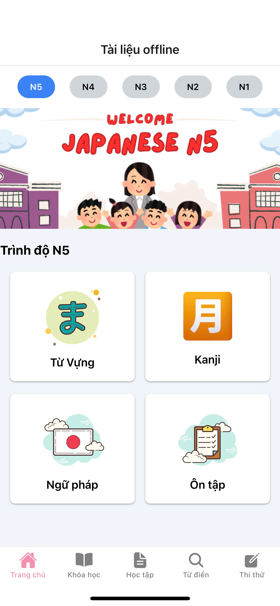
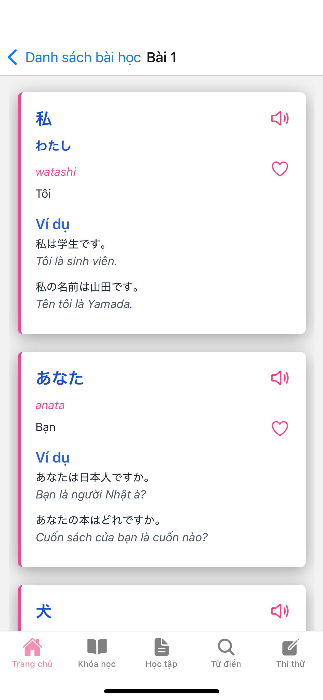
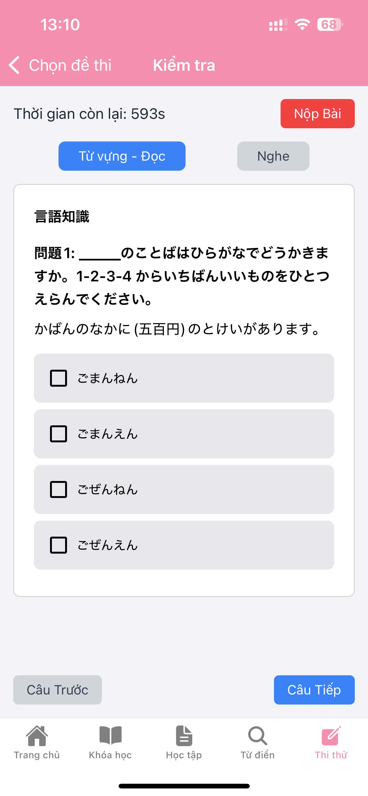
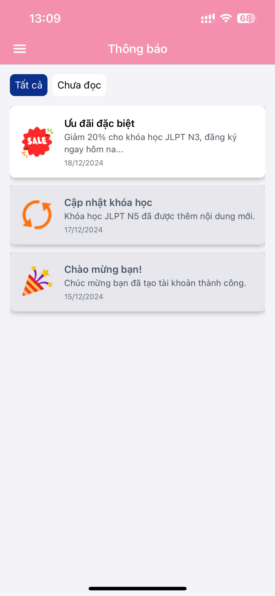

# 🌸 Sakura Japanese アプリ

## 説明

**Sakura Japanese** は、React Native を使用して開発されたマルチプラットフォームの日本語学習アプリです。使いやすいインターフェース、直感的な学習機能、そして最適化されたインタラクションを通じて、楽しく効果的な学習体験を提供します。

👉 **アプリのデモ動画はこちら**: [Sakura Japanese デモ](https://drive.google.com/file/d/1StUK2FoJgnR8bYuDcyT8XhdxukqHESMw/view?usp=sharing)

## 開発理由

グローバル化が進む現代社会では、外国語を学ぶことは個人のスキルアップだけでなく、競争力を持ち成功するための必須条件となっています。その中でも日本語は、発展した国の言語であるだけでなく、多様な文化、強力な経済、そして先進技術を持つ言語として特別な位置を占めています。

オンラインプラットフォームを利用して日本語を学ぶことが一般的なトレンドとなっていますが、成功するプラットフォームはコンテンツの質だけでなく、ユーザーエクスペリエンス（UX）にも大きく依存します。しかし、現在のところ、直感的で美しいインターフェースを備えた日本語学習サイトを見つけるのは困難です。

そこで、ユーザーのニーズを徹底的に研究・分析し、合理的なデザインソリューションを提案することで、直感的で使いやすく、効果的なインターフェースを持つ日本語学習アプリの開発を目指しました。このアプリは、ユーザーの学習体験をより充実させ、インタラクションを促進し、学習効率を高めることを目的としています。

## インターフェースの画像

以下は、Figma を使用してデザインされた Sakura Japanese アプリのインターフェースの一部です：

### ログイン/登録ページ




### ホームページ


### 単語検索ページ



### オフライン資料ページ





### コースページ


### カートページ


### 模擬試験ページ



### 通知ページ



## 主な機能

- **学習資料**: ユーザーのレベルごとに無料の学習資料を提供し、最適なレッスンを簡単に選択できるようにします。
- **多様なコース**: 初級から上級までのコンテンツを含み、各レッスンにはビデオ講義と資料が付属しています。
- **練習問題とテスト**: 知識を強化し、定期テストを通じて学習レベルを評価します。
- **辞書機能**: 日本語学習をサポートする統合辞書機能により、学習時の集中力を高めます。

## 使用技術

### バックエンド
- **Node.js**: アプリの API を構築するための主要プラットフォーム。
- **使用技術**:
  - Express.js: HTTP リクエスト処理用フレームワーク。
  - Mongoose: MongoDB データベースの管理。
  - JSON Web Token (JWT): 認証とセキュリティ。

### フロントエンド
React Native アプリは、以下の技術を使用してインターフェースとユーザーエクスペリエンスを最適化しています：
1. **Navigation**: 画面間のナビゲーション管理。
2. **Axios**: API 呼び出しライブラリ。
3. **Async Storage**: モバイルデバイスでのローカルデータ保存。
4. **Nativewind**: Tailwind CSS を React Native で使用するためのライブラリ。
5. **React Native Reanimated**: スムーズなアニメーション作成。
6. **React Native Safe Area Context**: デバイスの安全領域の管理。
7. **React Native SVG & React Native SVG Transformer**: SVG 画像の表示と管理。
8. **React Native Video**: アプリ内でのビデオ再生。
9. **React Native Webview**: アプリ内での Web コンテンツ表示。
10. **React Native Youtube Iframe**: YouTube 動画の埋め込みと再生。
11. **Swiper**: インターフェースのスライドエフェクト。
12. **Lottifile**: Lottie アニメーションの表示。

## インストールと実行

### システム要件
- Node.js (バージョン >= 14)
- React Native CLI または Expo CLI
- モバイルデバイス (Android/iOS) またはエミュレーター

### インストール手順

1. **プロジェクトのクローン**:
   ```bash
   git clone https://github.com/ntruong1710/sakura-japanese.git
   cd japanese-learning-app
    ```
2. **依存関係のインストール**:
   ```bash
   cd frontend
   npm i
   ```
   ```bash
   cd backend
   npm i
   ```
3. **プロジェクトの実行 (2つのターミナルで実行)**:
   ```bash
   cd frontend
   npm start
   ```
   ```bash
   cd backend
   npm start
   ```
4. **デモの実行**
   スマートフォンで QR コードをスキャンして Expo Go でデモを実行するか、Android Studio で "a" キーを押してデモを実行します。

## コントリビューション

このプロジェクトへの貢献を歓迎します。アイデアや開発に参加したい場合は、リポジトリをフォークしてプルリクエストを送信してください。また、問題の報告や新機能の提案は issue にて受け付けています。

## お問い合わせ

質問やフィードバックがある場合は、以下のメールアドレスにご連絡ください：ntruong0961@gmail.com

---

Sakura Japanese が日本語学習の旅において役立つツールになることを願っています。ご関心とご支援に感謝します！


# 🌸 Sakura Japanese App

## Mô tả

**Sakura Japanese** là một ứng dụng học tiếng Nhật đa nền tảng, được phát triển bằng React Native. Ứng dụng mang đến trải nghiệm học tập thú vị và hiệu quả, nhấn mạnh vào việc cải thiện trình độ tiếng Nhật thông qua giao diện thân thiện, các tính năng học tập trực quan, và sự tương tác tối ưu.

👉 **Xem video demo ứng dụng tại đây**: [Sakura Japanese App Demo]([https://www.youtube.com/watch?v=your-demo-link](https://drive.google.com/file/d/1StUK2FoJgnR8bYuDcyT8XhdxukqHESMw/view?usp=sharing)) 

## Lí do phát triển

Trong bối cảnh toàn cầu hóa ngày càng phát triển, việc học ngoại ngữ không chỉ là một lợi thế cá nhân mà còn là một yêu cầu cần thiết để cạnh tranh và thành công trong môi trường làm việc hiện đại. Trong số các ngôn ngữ được người học quan tâm, tiếng Nhật nổi bật với vị trí đặc biệt, không chỉ là ngôn ngữ của một quốc gia phát triển mạnh mà còn là ngôn ngữ của văn hóa đa dạng, nền kinh tế mạnh mẽ và công nghệ tiên tiến.

Để đáp ứng nhu cầu ngày càng tăng của người học tiếng Nhật, việc sử dụng các nền tảng trực tuyến để học ngôn ngữ đã trở thành một xu hướng không thể phủ nhận. Tuy nhiên, sự thành công của một nền tảng học trực tuyến phụ thuộc không chỉ vào chất lượng nội dung mà còn vào trải nghiệm người dùng thông qua giao diện. Tuy nhiên đến thời điểm hiện tại, việc tìm ra một website học tiếng Nhật có giao diện trực quan, đẹp mắt là một điều rất khó. 

Nhận thức rõ ràng về tầm quan trọng của việc tạo ra một giao diện trực quan, thân thiện và hiệu quả cho một website học tiếng Nhật, chúng tôi đã tập trung vào việc nghiên cứu, phân tích để hiểu rõ nhu cầu của người dùng, từ đó đề xuất các giải pháp thiết kế giao diện hợp lý, đặt mục tiêu tạo ra một giao diện mang lại trải nghiệm học tập đáng nhớ, khuyến khích sự tương tác và nâng cao hiệu suất học tập.

## Một số hình ảnh giao diện

Dưới đây là một số hình ảnh giao diện của Sakura Japanese được thiết kế bằng Figma:

### Trang đăng nhập/đăng ký


### Trang chủ


### Trang tra cứu từ vựng


### Trang tài liệu ofline


### Trang khóa học


### Trang giỏ hàng


### Trang thi thử


### Trang thông báo


## Tính năng chính

- **Tài liệu học tập**: Tài liệu học tập miễn phí, được chia theo từng level của người dùng, giúp người dùng có thể dễ dàng lựa chọn bài học phù hợp với trình độ của mình.

- **Khóa học đa dạng**: Bao gồm nội dung từ cơ bản đến nâng cao, phù hợp với mọi cấp độ người học, mỗi bài học có video bài giảng và tài liệu kèm theo.
  
- **Bài tập và kiểm tra**: Giúp người học củng cố kiến thức và đánh giá trình độ thông qua các bài kiểm tra định kỳ.
  
- **Từ điển**: Tích hợp từ điển tiếng Nhật hỗ trợ quá trình học tập, giúp năng mức độ tập trung của người dùng khi học tiếng Nhật.


## Công nghệ sử dụng

### Backend
- **Node.js**: Nền tảng chính để xây dựng API cho ứng dụng.
- **Backend Dependencies**:
  - Express.js: Framework cho việc xử lý các yêu cầu HTTP.
  - Mongoose: Quản lý cơ sở dữ liệu MongoDB.
  - JSON Web Token (JWT): Xác thực và bảo mật.

### Frontend
Ứng dụng React Native sử dụng các công nghệ sau để tối ưu hóa giao diện và trải nghiệm người dùng:
1. **Navigation**: Quản lý điều hướng giữa các màn hình.
2. **Axios**: Thư viện gọi API.
3. **Async Storage**: Lưu trữ dữ liệu cục bộ trên thiết bị di động.
4. **Nativewind**: Thư viện hỗ trợ sử dụng Tailwind CSS với React Native.
5. **React Native Reanimated**: Tạo hiệu ứng động mượt mà.
6. **React Native Safe Area Context**: Quản lý khoảng cách an toàn trên các thiết bị di động.
7. **React Native SVG & React Native SVG Transformer**: Hiển thị và quản lý các hình ảnh SVG.
8. **React Native Video**: Phát video trong ứng dụng.
9. **React Native Webview**: Hiển thị nội dung web bên trong ứng dụng.
10. **React Native Youtube Iframe**: Nhúng và phát video YouTube.
11. **Swiper**: Tạo hiệu ứng trượt cho giao diện.
12. **Lottifile**: Hiển thị các hiệu ứng động Lottie.

## Cách cài đặt và chạy ứng dụng

### Yêu cầu hệ thống
- Node.js (phiên bản >= 14).
- React Native CLI hoặc Expo CLI.
- Thiết bị di động (Android/iOS) hoặc trình giả lập.

### Hướng dẫn cài đặt

1. **Clone dự án**:
   ```bash
   git clone https://github.com/ntruong1710/sakura-japanese.git
   cd japanese-learning-app
   ```
2. **Cài đặt phụ thuộc**:
   ```bash
   cd frontend
   npm i
   ```
   ```bash
   cd backend
   npm i
   ```
3. **Chạy dự án (mở 2 terminal)**:
   ```bash
   cd frontend
   npm start
   ```
   ```bash
   cd backend
   npm start
   ```
4. **Chạy demo**
   Dùng điện thoại quét QR code để chạy demo trên Expo Go. Bạn cũng có thể chạy demo trên Android Studio bằng cách ấn phím "a"

## Đóng góp

Tôi hoan nghênh mọi đóng góp để hoàn thiện dự án này. Nếu bạn có ý tưởng hoặc muốn tham gia phát triển, vui lòng fork repository và gửi pull request. Bạn cũng có thể mở issues để báo cáo lỗi hoặc đề xuất tính năng mới.

## Liên hệ

Nếu có bất kỳ câu hỏi hoặc phản hồi nào, vui lòng liên hệ qua email: ntruong0961@gmail.com.

---

Tôi hy vọng Sakura Japanese sẽ là một công cụ hữu ích cho bạn trên con đường học tiếng Nhật. Cảm ơn bạn đã quan tâm và ủng hộ dự án!
   
